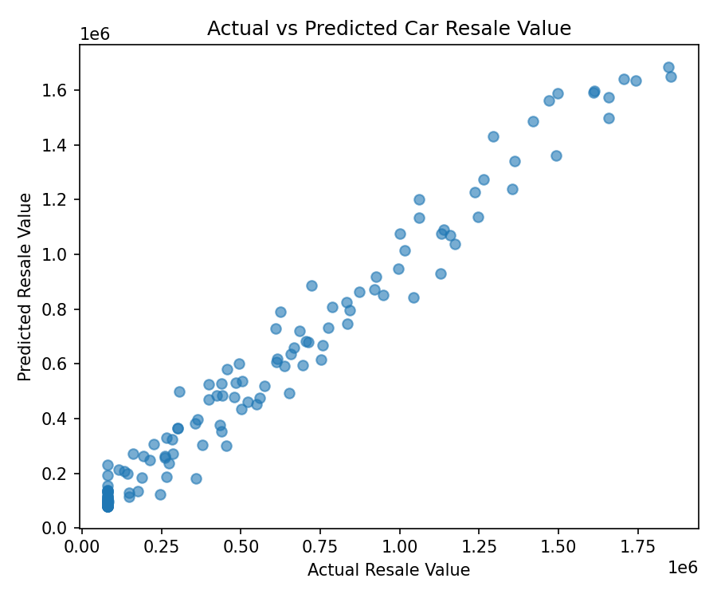

# car_resale_value_prediction
# #  Car Resale Value Prediction using Python & Scikit-learn

A machine learning project that predicts the **estimated resale value of a car** based on important vehicle characteristics such as car age, kilometers driven, engine size, number of owners, fuel type, and brand.

The project uses **Python, Pandas, Scikit-learn, Random Forest Regression, One-Hot Encoding, and Joblib** to build, evaluate, save, and use a machine-learning model.

##  Project Overview

Determining the resale value of a used car can depend on several factors. This project demonstrates how machine learning can be used to estimate a car's resale value from historical vehicle data.

The model takes the following inputs:

*  Car age in years
*  Kilometers driven
*  Engine size in liters
*  Number of previous owners
*  Fuel type
*  Car brand

The output is the predicted **resale value in Indian Rupees (₹)**.

> **Note:** The included dataset is synthetic and is intended for educational and demonstration purposes.

##  Machine Learning Model

The project uses a **Random Forest Regressor** for predicting resale value.

### Preprocessing

Categorical features:

* `fuel_type`
* `brand`

These categorical features are converted using **OneHotEncoder**.

Numerical features:

* `car_age_years`
* `kilometers_driven`
* `engine_liters`
* `number_of_owners`

The preprocessing and machine-learning model are combined using a Scikit-learn **Pipeline**.

##  Model Performance

The dataset is divided into:

* **80% training data**
* **20% testing data**

Using the current project configuration, the model achieved:

| Metric   |      Score |
| -------- | ---------: |
| MAE      | ₹58,600.66 |
| RMSE     | ₹78,304.67 |
| R² Score |     0.9748 |

### Evaluation Graph

The project generates an **Actual vs Predicted Car Resale Value** graph:



##  Project Structure

```text
Car_Resale_Value_Prediction_Sklearn/
│
├── data/
│   └── car_resale_value.csv
│
├── actual_vs_predicted.png
├── car_resale_value_model.pkl
├── predict.py
├── train_model.py
├── requirements.txt
└── README.md
```

##  Technologies Used

* **Python**
* **Pandas** — data loading and processing
* **Scikit-learn** — machine learning and evaluation
* **Random Forest Regressor** — regression model
* **OneHotEncoder** — categorical data encoding
* **Joblib** — model saving and loading
* **Matplotlib** — visualization

##  Installation

Clone the repository:

```bash
git clone https://github.com/YOUR-USERNAME/Car_Resale_Value_Prediction_Sklearn.git
```

Move into the project directory:

```bash
cd Car_Resale_Value_Prediction_Sklearn
```

Install the required libraries:

```bash
pip install -r requirements.txt
```

##  Train the Model

Run:

```bash
python train_model.py
```

This will:

1. Load the car resale dataset.
2. Separate features and target values.
3. Encode categorical features.
4. Split the data into training and testing sets.
5. Train the Random Forest Regression model.
6. Evaluate the model using MAE, RMSE, and R².
7. Save the trained model as `car_resale_value_model.pkl`.
8. Generate the `actual_vs_predicted.png` evaluation chart.

##  Make a Prediction

Run:

```bash
python predict.py
```

The prediction script uses a sample car with values such as:

```text
Car Age: 5 years
Kilometers Driven: 65,000 km
Engine: 1.5 L
Owners: 1
Fuel Type: Petrol
Brand: Toyota
```

The model then displays the estimated resale value in Indian Rupees.

##  Project Objectives

* Understand the basics of regression-based machine learning.
* Learn how to preprocess categorical and numerical data.
* Train a Random Forest Regression model.
* Evaluate model performance using standard regression metrics.
* Save and reuse a trained machine-learning model.
* Make predictions on new car data.
* Practice building a complete beginner-friendly ML project.

##  Future Improvements

The project can be extended by:

* Adding more real-world vehicle data.
* Comparing multiple regression algorithms.
* Performing hyperparameter tuning.
* Adding feature importance analysis.
* Creating a Streamlit web application.
* Adding an interactive prediction form.
* Improving data validation and preprocessing.
* Deploying the model as a web application or API.

##  Disclaimer

This project is created for **educational and demonstration purposes**.

The dataset is synthetic, so predictions should **not be considered real-world market valuations** or used for actual vehicle buying or selling decisions.

